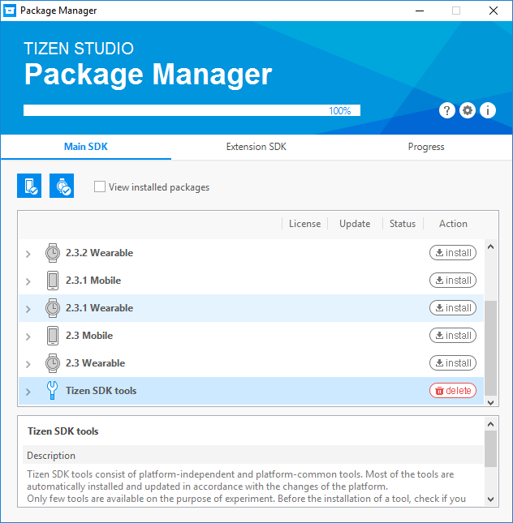
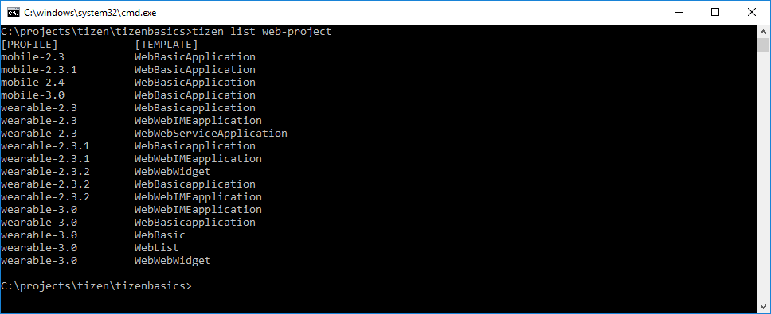

# A basic tizen CLI project

The purpose of this project is to create a very basic tizen application for a watch using HTML5. It will be a simple watch face that tells the time and maybe uses some additional fancy feature (for those people who can't stand a time that does nothing but tell the time) such as showing heart beat.

I will be using the command line interface (CLI) in this tutorial because, frankly, the **Tizen Studio** is so horrible I don't ever want to use it again.

# Prerequisites

Check that you have the following before you start (more specific [https://developer.tizen.org/development/tools/download/installing-sdk/prerequisites](here)):

 * Windows, Linux or Mac
 * JDK 7+
 * A command prompt

# Installation

Download the installer here: [https://developer.tizen.org/development/tizen-studio/download](Tizen download).

Now, this is a bit tricky, but I urge you to **install the SDK using the IDE installer** as I first installed it with the CLI installer and never got it working.

Once you have installed it you will be asked if you want to open the _package manager_ which you want. Once in it you want to install the latest wearable package. In my case that was **3.0 Wearable**. You also want to install the **Tizen SDK tools**:



After that you can find the whole installation under `C:\tizen-studio` (unless you changed this, in which case I have no idea where it is). You want to add the binaries folder to your PATH and they are found in `C:\tizen-studio\tools\ide\bin`.

# How about this horrible CLI package

Now, there is documentation for how to use this horrible CLI and it can be found [https://developer.tizen.org/development/tools/web-tools/command-line-interface](here). Whatever you do, don't read up on their wiki (which I won't link to) because it's terribly out of date (when I just looked it hasn't been updated for a year and most links are broken). My first installation of the whole shebang went so bad I couldn't start a project because the whole thing kept throwing java exceptions.

So why are we using the CLI if the documentation is bad and it crashes? Well, because the IDE is even worse and after having done a whole app in it I'm not touching it again. The plan is to only use the CLI for:

 * Creating a project
 * Building that project
 * Running an emulator
 * Installing on that emulator for tests

I want to work with some sort of transpiler and structure and the IDE was a mess to jump in and out of. The CLI is the minimum contact we'll have to have with Tizen itself.

# Where do we start?

We start with creating a project of course. If you've looked through the documentation you'll find that there are a whole bunch of useful commands available for you, one of them is the list project. It takes a parameter which is what you want to list. If you just enter `tizen list` it will show you what you can list, which is:

 * native-project
 * web-project
 * rootstrap

We want to list web-projects to see what profile and template to you, so run the command `tizen list web-project` and you might see something like this:



Notice the completely broken camelCase template names? I have no idea what the developers of Tizen are doing but they sure aren't paying attention to the details. Anyway, it's time to create a project and the command for that is, surprisingly, `tizen create`. We want to use wearable-3.0 as profile and use the WebBasicapplication as template. Given that I want to put all my development code in a source folder I'll call the project folder src and put it in a parent (as you can see in this project). So the command will be: 

```
tizen create web-project -n src -p wearable-3.0 -t WebBasicapplication
```

The first thing we want to do is to see if we can build this. Now, this isn't one of these user friendly CLI's that just work for the user, instead you're going to have to work for the CLI. We use the `build-web` command and the `-out` flag to set where we want our build output. Now, you'd think this would work from you current position, but it doesn't. Instead this path is relative to the source path, set with `--`... 

```
tizen build-web -out ../dist/ -- C:\projects\tizen\tizenbasics\src
```

